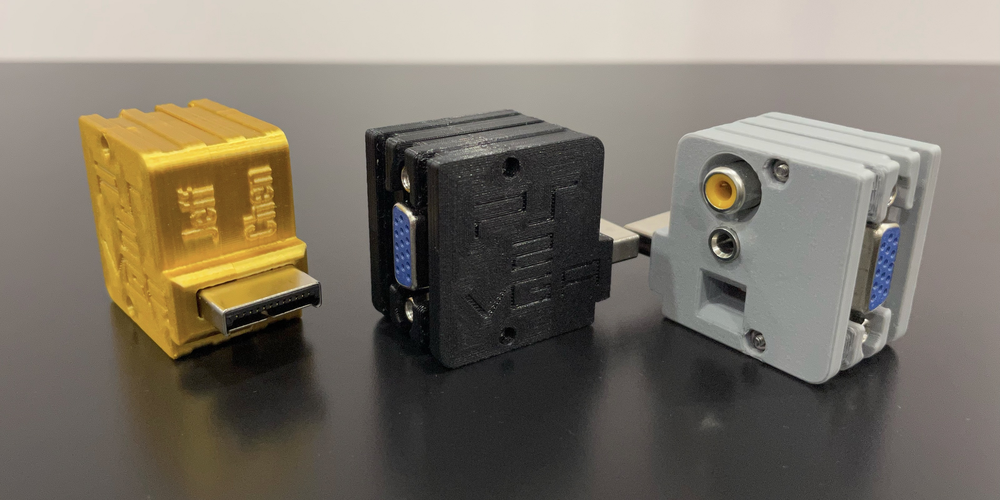
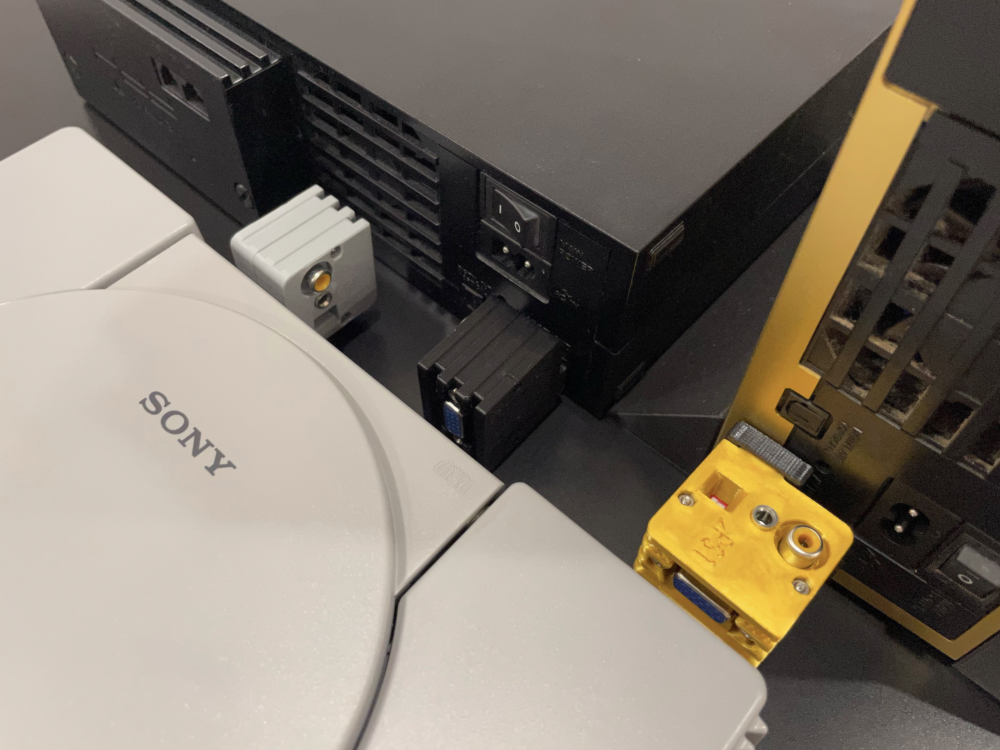

# PS2VGA

This is an RGB+CSync video and stereo audio analogue output dongle, with a VGA port, a 3.5mm jack and an RCA jack, for the entire PlayStation family. It is a member from my [Console VGA Dongle Series](https://github.com/jeffqchen/Console-VGA-Dongle-Series).

Please refer to the **[Project Wiki](https://github.com/jeffqchen/PS2VGA/wiki)** regarding technical details, parts and building guide.

---------
## Special Thanks

- Mike Chi of [RetroTINK](https://www.retrotink.com) - [Twitter](https://twitter.com/retrotink2)

- Javier Rodas - [Twitter](https://twitter.com/JaviRodasG)

- Retro Gamer Stuff (Bad_Ad84) - [Twitter](https://twitter.com/RetroGamerStuff)
